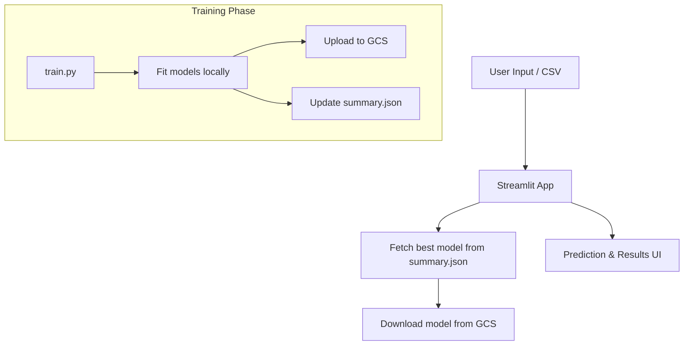

# 🚲 Bike Count Prediction

### (Streamlit + MLflow + GCS + DIY Registry)

A lightweight, production-ready ML app to predict **hourly bicycle traffic** in Paris using either a **Random Forest** or **Neural Network** model.

> Do want to see it in action ? [Here's our Streamlit Cloud endpoint!](https://dstrafficcyclist1.streamlit.app/))

---

## 🎯 Features

* 🧠 Predict with **Random Forest** or **Neural Network**
* 🌐 Deployable on **Streamlit Cloud** (zero backend)
* ☁️ Inference powered by **GCS-hosted models**
* 📊 Supports both single & batch predictions
* 🧰 Uses a custom `summary.json` registry — no MLflow dependency at runtime

---

## 🛠 Architecture Overview



---

## 🧠 MLflow-Free Inference (Custom Registry)

Rather than querying the MLflow registry at runtime, we:

* 🔖 Maintain a lightweight **`summary.json`** file in GCS
* 🧼 Store the **best model only**, filtered by `model_type`, `env`, and `test_mode`
* 📦 Pull model artifacts directly from GCS inside the Streamlit app

✅ Advantages:

* No MLflow server required at inference
* Faster app startup
* Easy deployment on **Streamlit Cloud**

---

## 🚀 Deploy to Streamlit Cloud

Your app is plug-and-play with Streamlit Cloud.

### 1. Push to GitHub

Make sure you include:

* `requirements.txt`
* The full `app/` folder

### 2. Launch the app

Go to [https://share.streamlit.io](https://share.streamlit.io), and select:

```
app/streamlit_app.py
```

### 3. Configure GCP secrets

Paste your service account JSON into Streamlit secrets:

```toml
[gcp_service_account]
# Paste your full service account JSON key here (see )
[env]
ENV="PROD"
```

> More on how to configure it? [Go to GCP setup](#-gcp-service-accounts-setup).

✅ Done. Streamlit now:

* Loads the best model from `summary.json`
* Downloads model weights from GCS
* Predicts live on user input or CSV

---

## 🔧 Local Dev & Training

### Prerequisites

```bash
uv init
uv venv
uv sync
source .venv/bin/activate
```

### Training

```bash

# avant tout
GOOGLE_APPLICATION_CREDENTIALS=./mlflow-trainer.json

# Fast dev run
python app/train.py --env dev --model_test

# Full training + GCS upload
python app/train.py --env prod

# For dev purposes. If you're in prod, see Streamlit Cloud section
streamlit run app/streamlit_app.py
```

---

## 📺 (Optional) MLflow Tracking UI

### In DEV
```bash
# Create artifact path
mkdir -p mlruns_dev/artifacts

# Use GCP key for UI access
export GOOGLE_APPLICATION_CREDENTIALS=./mlflow-ui-access.json

# Launch UI server in DEV

mlflow server \
  --backend-store-uri file:./mlruns_dev \
  --default-artifact-root file:./mlruns_dev/artifacts \
  --host 127.0.0.1 \
  --port 5000
```

### In PROD

```bash
# Create artifact path
mkdir -p mlruns_prod/artifacts

# Use GCP key for UI access
export GOOGLE_APPLICATION_CREDENTIALS=./mlflow-ui-access.json

# Launch UI server in PROD
mlflow server \
  --backend-store-uri file:./mlruns_prod \
  --default-artifact-root gs://df_traffic_cyclist1/mlruns \
  --serve-artifacts \
  --host 127.0.0.1 \
  --port 5000

```

---

## 🔐 GCP Service Accounts Setup

This project uses **three GCP service accounts** to separate roles cleanly:

| Service Account       | Role                    | Used for                      |
| --------------------- | ----------------------- | ----------------------------- |
| `mlflow-trainer`      | `Storage Object Admin`  | Training + model upload       |
| `mlflow-ui-access`    | `Storage Object Viewer` | Accessing MLflow UI in prod   |
| `gcp_service_account` | `Storage Object Viewer` | Streamlit app model inference |

### DEV: Create and .env file

In root from your repo, with this structure:

```
ENV=DEV
GCP_SERVICE_ACCOUNT=./gcp.json
```

> And, if you're using MLFlow in a semi-prod mode, you'll need `mlflow-ui-access.json` and `mlflow-trainer.json` in root too.  

### PROD: Setup Instructions

1. Go to [IAM → Service Accounts](https://console.cloud.google.com/iam-admin/serviceaccounts)
2. Create each account and assign roles
3. Download each JSON key securely

---

## 🗂 Directory Structure

```bash
app/
├── app_config.py              # Ensures src/app is in sys.path
├── streamlit_app.py           # UI logic
├── train.py                   # CLI trainer
├── model_registry_summary.py  # Custom registry loader
├── classes.py                 # RF & NN pipeline classes
data/
models/
mlruns/                        # Optional MLflow UI
```

---

## 💡 Notes & Tips

* Cold-starts are fast thanks to direct GCS access

* Easily extendable to support additional models, thanks to their encapsulation within classes.

---

## 👨‍🔬 Authors

Built with ❤️ by:

* [Arthur Cornélio](https://github.com/arthurcornelio88)
* [Ibtihel Nemri](https://github.com/ibtihelnemri)
* [Bruno Happi](https://github.com/brunoCo-de)
