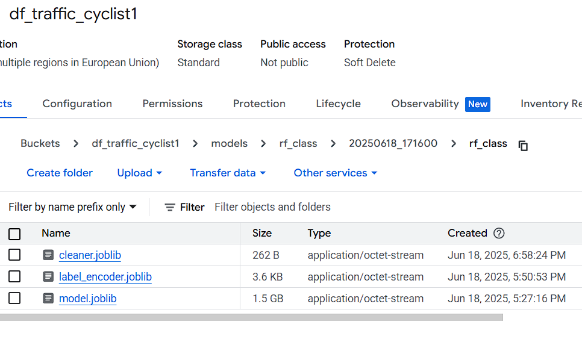
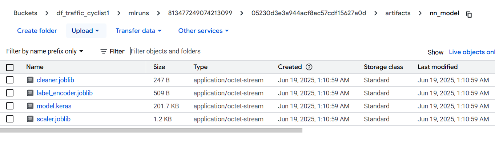

# 🧭 Documentation — Architecture MLFlow & Registry pour Bike Traffic

## 📌 Vue d’ensemble

Ce projet prédit le **comptage horaire de vélos à Paris** à partir de données brutes issues des capteurs. Il inclut :

* **3 modèles ML** : Random Forest (régression), Neural Net (régression), RF Classifier (classification binaire)
* Un pipeline de traitement + entraînement + sauvegarde des artefacts
* Un suivi de modèles via **MLflow** (local/dev ou GCS/prod)
* Une application **Streamlit** connectée à un registre de modèles `summary.json` dans GCS

---

## 🏗️ 1. Pipelines de traitement

### ✔️ Nettoyage commun à tous :

* Classe `RawCleanerTransformer`

  * Standardise les noms de colonnes
  * Extrait des features temporelles (`jour`, `heure`, etc.)
  * Parse les coordonnées géographiques
  * Encode les jours de semaine
  * Nettoie `nom_du_compteur`

### ✔️ Modèles spécifiques :

| Pipeline                      | Type                   | Architecture                                                        |
| ----------------------------- | ---------------------- | ------------------------------------------------------------------- |
| `RFPipeline`                  | Régression             | sklearn `RandomForestRegressor` + preprocessing `ColumnTransformer` |
| `NNPipeline`                  | Régression             | Keras NN avec embedding + features scalés                           |
| `AffluenceClassifierPipeline` | Classification binaire | sklearn `RandomForestClassifier` + stratified split                 |

---

## 🧪 2. Entraînement (`train.py`)

### 🎛️ Mode `dev` vs `prod`

| Mode   | Données                      | MLflow Tracking                               | Artefacts                                                      |
| ------ | ---------------------------- | --------------------------------------------- | -------------------------------------------------------------- |
| `dev`  | CSV local (`./data/`)        | `http://127.0.0.1:5000` local + `mlruns_dev/` | Sauvegarde locale dans `./models/`                             |
| `prod` | Données sur GCS (`gs://...`) | Même MLflow, mais artefacts = GCS             | Export modèle + résumé dans `gs://df_traffic_cyclist1/models/` |

### 📦 Entraînement complet via :

```bash
python src/train.py --env prod
```

* Enregistre chaque run dans MLflow
* Sauvegarde les modèles dans `tmp_*`
* Upload dans `gs://df_traffic_cyclist1/models/{model_type}/{timestamp}/`
* Met à jour le registre `summary.json`




### 2.5 🗄️ MLflow Tracking : `mlruns` en local vs GCP

Le dossier `mlruns/` est la **colonne vertébrale du suivi MLflow**. Il contient :

* les **métadonnées des entraînements** (hyperparamètres, métriques, tags…)
* les **artefacts enregistrés** (modèles `.joblib`, `.keras`, images, logs…)

Le projet distingue deux environnements bien isolés :

---

#### 🧪 Environnement `dev`

* **Backend Store (local)** :

  * Tous les runs sont sauvegardés dans le dossier local :

    ```
    ./mlruns_dev/
    └── <experiment_id>/
        └── <run_id>/
            └── meta.yaml, params/, metrics/
    ```

* **Artifact Store (local aussi)** :

  * Les artefacts générés (modèles, logs) sont stockés dans :

    ```
    ./mlruns_dev/<experiment_id>/<run_id>/artifacts/
    ```

💡 Ce mode permet de travailler en local sans dépendre du cloud.

---

#### ☁️ Environnement `prod`

* **Backend Store (local)** :

  * Les métadonnées sont toujours stockées localement :

    ```
    ./mlruns_prod/
    ```

* **Artifact Store (cloud - GCS)** :

  * Les fichiers artefacts sont stockés dans :

    ```
    gs://df_traffic_cyclist1/mlruns/<experiment_id>/<run_id>/artifacts/
    ```

    

🎯 Avantage : les modèles et logs sont accessibles dans le cloud, mais on garde un historique local de tous les entraînements.

---

### 🔍 Visualisation dans MLflow

Qu'on soit en `dev` ou `prod`, les expériences apparaissent dans **la même interface MLflow UI**, par exemple :

```
http://127.0.0.1:5000/#/experiments/0
```

La différence se fait dans le **chemin d’accès aux artefacts** affiché :

* `file:///.../mlruns_dev/...` pour `dev`
* `gs://.../mlruns/...` pour `prod`

---

## 📚 3. Registre de modèles (`summary.json`)

### Format :

```json
{
  "timestamp": "2025-06-18T22:59:26.111358",
  "model_type": "nn",
  "env": "prod",
  "test_mode": true,
  "run_id": "abcd...",
  "r2": 0.71,
  "rmse": 54.9,
  "model_uri": "gs://df_traffic_cyclist1/models/nn/20250619_005924/"
}
```

🧠 C’est un historique **append-only** qui stocke tous les modèles entraînés en `prod`.

### ✨ Géré automatiquement par :

```python
update_summary(...)
```

---

## 🔎 4. Sélection dynamique des modèles

L'application Streamlit (et n’importe quel consumer) peut charger le **meilleur modèle** en fonction :

* du `model_type` (`rf`, `nn`, `rf_class`)
* du `metric` (`r2`, `f1_score`, etc.)
* de l’`env` et du `test_mode`

### Chargement via :

```python
from app.model_registry_summary import get_best_model_from_summary

pipeline = get_best_model_from_summary(
    model_type="nn",
    summary_path="gs://df_traffic_cyclist1/models/summary.json",
    metric="r2",
    env="prod",
    test_mode=True
)
```

💡 Il télécharge les artefacts depuis GCS dans `/tmp/`, détecte automatiquement les bons sous-dossiers (`rf/`, `nn/`, etc.), et recharge le bon modèle via `.load()`.

---

## 🎛️ 5. Application Streamlit

### ✅ Fonctionnalités :

* Choix entre `Random Forest`, `Neural Net`, `RF Classifier (Affluence)`
* Mode prédiction manuelle ou batch CSV
* Téléchargement du fichier de prédiction
* Chargement des modèles en cache depuis `summary.json`

### 🔒 Sécurité :

* Les credentials GCP sont automatiquement injectés depuis `st.secrets` ou une variable d’environnement

---

## 🧠 Design Patterns clés

* **`summary.json` comme registre statique et décentralisé**
* **Logging append-only** → traçabilité historique
* **Chargement dynamique du “best model”** basé sur des métriques
* **Séparation claire des modes `dev` et `prod`**
* **Upload vers GCS + MLflow tracking = audit complet**